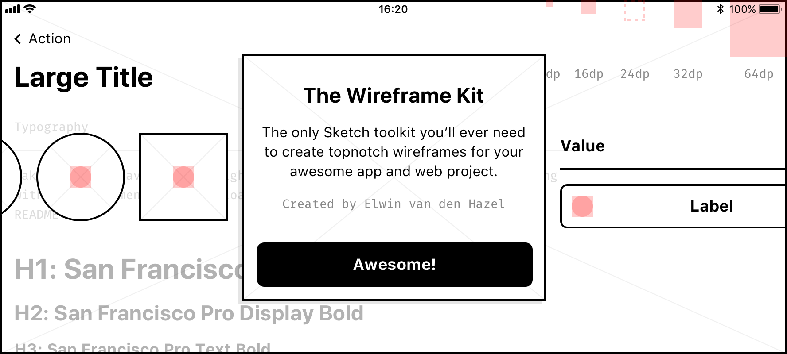

# :gem: The Wireframe Kit
>The only Sketch toolkit you’ll ever need to create topnotch wireframes for your awesome app and web project.
~Created by [Elwin van den Hazel](https://elwin.vdhazel.com)

## ⚙️ Installation
1. Clone or download this repo
2. Install the [resources](#-resources)
3. Open [`TheWireframeKit.sketch`](https://github.com/elwinvdhazel/The-Wireframe-Kit/blob/master/source/TheWireframeKit.sketch) in Sketch
4. Optional: Add as library `File > Add as library…`
5. Enjoy!

## 🛠 Resources
The Wireframe Kit makes use of some resources:

### Fonts
The official Apple SF Pro Typeface (Regular & Bold) and the Fira mono font are used.
Download & install the fonts first before you start:
- :package: Download [Apple San Francisco Pro](https://developer.apple.com/fonts/)
- :package: Download [Fira mono](https://mozilla.github.io/Fira/)

### Icons
For the icons, a (unofficial) [Material design icon-set](https://github.com/zsoltszilvai/Material-icons-sketch-library-with-color-overrides) is added as submodule.
To use this icon-set:
- :package: Open [`Material_icons_library.sketch`](https://github.com/elwinvdhazel/The-Wireframe-Kit/blob/master/submodules/Material-icons-sketch-library-with-color-overrides/Material_icons_library.sketch) in Sketch and add as a library `File > Add as library…`.

*It is possible, of course, to use your own or other icon libraries. As long as the icons are 24 x 24px in size.*

## :open_file_folder: What's inside?
### Text styles
The Wireframe Kit includes a set of predefined text styles. For Sketch <= 50 use the [Sketch Style Libraries](https://github.com/sigtm/sketch-style-libraries) plugin to sync the text styles.

### Symbols
The Wireframe Kit includes all the basic symbols you’ll need for your next project.
With this set of symbols, you can create endless variations and combinations to build your interface.

#### Missing something? 
Need something that’s not in The Kit?
Be creative and see if you can make something new by combining existing symbols.

If that’s not working out, create a [new issue](https://github.com/elwinvdhazel/The-Wireframe-Kit/issues/new).

### Metrics
To keep your wireframes consistent, The Kit makes use of the binary number system for the size, spacing and aligning of elements.

*Pro tip: In sketch, use the “alt” key + mouse hovering to check the distance between elements*

### Prototype 
If you have a recent version of Sketch (> 49) you can make use of the prototype feature of sketch. :muscle:

:information_source: [Check here](https://sketchapp.com/docs/prototyping) for more info if you want to learn more about Sketch prototype.

## :tada: All set!
Now go and create some awesome wireframes! :ok_hand:

*If you notice any typos, errors, inconsistencies or if you have any questions or suggestions for improving The Wireframe Kit, please create a [new issue](https://github.com/elwinvdhazel/The-Wireframe-Kit/issues/new)*
